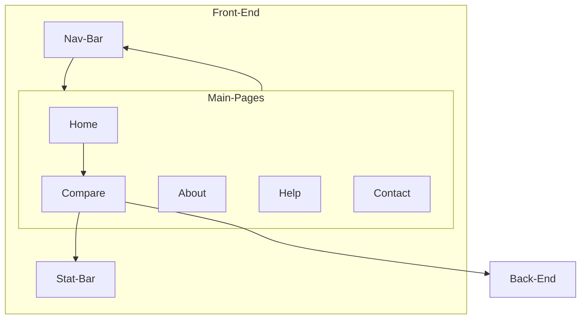

# AuthoWrite Front-End

*Created for the COMP30022 IT Project subject*

This project was generated with [Angular CLI](https://github.com/angular/angular-cli) version 16.1.5.

- [AuthoWrite Front-End](#authowrite-front-end)
    - [Members](#members)
  - [Description](#description)
  - [Key Algorithms](#key-algorithms)
    - [Methods](#methods)
    - [Events](#events)
  - [Key Classes \& Application Layers](#key-classes--application-layers)
  - [How To Use](#how-to-use)
  - [Installation Method](#installation-method)
  - [Deployment Method](#deployment-method)
  - [Release History](#release-history)

### <u>Members</u>

[`Adrian Podiono`](https://www.linkedin.com/in/adrian-podiono-787367246)  [`Hanizam Zaharyudin`](https://www.linkedin.com/in/hanizam-zaharyudin-1a5124198)  [`Jia Jie Zheng`](https://www.linkedin.com/in/thomas-zheng-7622a2190/)  [`Lin Xin Xie`](https://www.linkedin.com/in/linxx/)  [`Saaiq Ahmed`](https://www.linkedin.com/in/saaiq-ahmed-364b5a219/)

## Description

The front end repository for the AuthoWrite website created for the client [Eduardo Oliveira](https://www.eduoliveira.com/). The site allows a user to input or upload texts that are known to be written by someone to then help determine whether another text is written by that same author. We determine this through a model that can be found in our back-end which outputs an **Authorship Score** which is a percentage on the likelihood of the unknown text being written by that author. Alongside the score we are also given a list of other statistics comparing the known and unknown text for the user's insight.

## Key Algorithms
### Methods
`sendPostRequest()` : Takes the class variables of known and unknown texts and creates a multi-part form response which is outputted to the back end API. After receiving the API's response, the score and statistics are constructed and displayed. 

`showResults()` : Helper function to display the score and statistics

`setBarColour()` : Sets the colour between {`red`,`orange`,`green`} for the score
### Events
- `onSingleFileChange()` : Updates unknown file
- `onMultipleFileChange()` : Adds files to known file list  
- `onDeleteKnownFile()` : removes a known file by index
- `onDeleteUnknownFile()` : deletes an unknown file
- `onDeleteKnownText()` : deletes a known text by index
- `addKnownText()` : adds a known text

## Key Classes & Application Layers

**Compare** : Page where `sendPostRequest()` method is called which creates a **multi-part form** outputted to the back-end. 
**Nav-Bar** : component that adds a navigation bar to every page within **Main-Pages** EXCEPT **Home** but includes a link to every page within **Main-Pages**

<u>**Form Model**</u>

- **known_texts** : `List` of `string` variables for inputted known texts
- **unknown_text** : `string` variable of inputted unknown text
- **known_files** : `List` of raw `file` variables for uploaded known files
- **unknown_file** : raw `file` variable for uploaded unknown file
## How To Use

The website can be accessed using the link: [AuthoWrite](http://authowrite-front-end-bucket.s3-website-ap-southeast-2.amazonaws.com/)

Which comes with a tutorial on how to use the app by clicking the **(?)** button on the bottom right when you enter the site's compare page.

For anyone trying to run a clone of the website, please install Angular and node.js to run the website properly. To ensure the processing is functional, make sure the deployment of the [Back-End](https://github.com/Re-Roll/AuthoWrite-back-end) is publically available, where the [AuthoWrite Back-End Documentation](http://3.26.213.177:5000/docs) should be available to view.  

## Installation Method
1. Clone the repository
2. Make sure to have [NodeJS](https://nodejs.org/en) installed
3. Open up the terminal and type the commands:

```
npm install
npm install -g @angular/cli
ng serve
```
Now you will be able to access the website locally, where any changes will automatically update the locally running site. 

*NOTE: using `ng serve` will have images not functioning as the image file location has been set to account for when the website is hosted, to check images are working correctly, just change image file directory to the asset folder*

## Deployment Method

The front end was deployed using **CodePipeline** which was connected with the GitHub repository. The CodePipeline then included a Build phase which used **CodeBuild** to build the Angular app with the Buildspec:

    version: 0.2

    env:
        variables:
            CACHE_CONTROL: "86400"
            S3_BUCKET: "{{S3_BUCKET}}"
    phases:
        install:
            runtime-versions:
            nodejs: 18
            commands:
            - npm install
            - npm install -g @angular/cli
        build:
            commands:
            - ng build --configuration production
    artifacts:
        files:
            - '**/*'
        discard-paths: yes
        base-directory: 'dist*'

The final built Angular app is then pipelined to an **S3 Bucket** which publically hosts the website.

## Release History

*The release history doesn't align with actual releases as we didn't know they had to be formally included as well as our repositories being split*

*You can find the original repository using the link: [Original Repository](https://github.com/SaaiqAhmed/reroll)*

- 1.2.0 - added additional statistics
- 1.1.0 - added ability of uploading files
- 1.0.2 - Visual UI update
- 1.0.1 - Improved text input to be properly functional
- 1.0.0 - Added back-end connection
- 0.1.1 - Added non-functional results page
- 0.1.0 - Fixed colour scheme
- 0.0.2 - Added textbox styling
- 0.0.1 - Created template landing page
